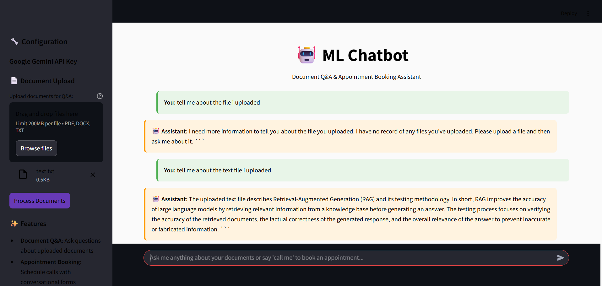

# 🤖 AI Document Q&A & Appointment Booking Chatbot

A sophisticated chatbot application that combines document question-answering capabilities with conversational appointment booking, built with Streamlit, Google Gemini AI, and advanced natural language processing.

## 📋 Project Overview

This project fulfills the ML task requirements by creating a comprehensive chatbot system that:
- **Answers user queries** from uploaded documents using RAG (Retrieval-Augmented Generation)
- **Collects user information** through conversational forms when users request callbacks
- **Integrates tool-agents** for appointment booking functionality
- **Validates user inputs** including email, phone numbers, and date formats
- **Extracts complete date formats** (YYYY-MM-DD) from natural language queries

## ✨ Key Features

### 🔍 Document Q&A System
- Upload multiple document formats (PDF, DOCX, TXT)
- Vector-based document search using embeddings
- Context-aware responses using Google Gemini 1.5 Flash
- Maintains conversation history and context

### 📅 Conversational Appointment Booking
- **Natural Language Processing**: Understands phrases like "next Monday", "tomorrow at 2 PM"
- **Smart Date Extraction**: Converts natural language to YYYY-MM-DD format
- **Input Validation**: Email format, phone number validation, date verification
- **Tool-Agent Integration**: Seamless form handling through conversational interface

### 🛡️ Advanced Validations
- **Email Validation**: Regex-based email format checking
- **Phone Number Validation**: International and local format support
- **Date Parsing**: Handles relative dates ("next Monday") and absolute dates
- **Real-time Feedback**: Immediate validation feedback to users

## 🏗️ Architecture

```
streamlit-chatbot/
├── app.py                     # Main Streamlit application
├── utils/
│   ├── __init__.py
│   ├── chatbot.py            # Core chatbot logic with tool integration
│   ├── document_processor.py # Document loading and vector store creation
│   ├── form_handler.py       # Conversational form management
│   └── date_extractor.py     # Natural language date parsing
├── requirements.txt          # Project dependencies
├── .gitignore               # Git ignore file
└── README.md               # Project documentation
```

## 🚀 Technology Stack

- **Frontend**: Streamlit (Interactive web interface)
- **LLM**: Google Gemini 1.5 Flash (Fast, efficient AI responses)
- **Vector Database**: FAISS (Document similarity search)
- **Document Processing**: PyPDF2, python-docx (Multi-format support)
- **Date Processing**: dateutil, custom NLP parsing
- **Validation**: Regex patterns, custom validators

## 📦 Installation & Setup

### Prerequisites
- Python 3.8+
- Google Gemini API Key

### Installation Steps

1. **Clone the repository**
   ```bash
   git clone https://github.com/yourusername/ai-chatbot-appointment-system.git
   cd ai-chatbot-appointment-system
   ```

2. **Install dependencies**
   ```bash
   pip install -r requirements.txt
   ```

3. **Run the application**
   ```bash
   streamlit run app.py
   ```

4. **Access the application**
   - Open your browser to `http://localhost:8501`
   - The app will initialize with the pre-configured API key

## 💡 Usage Examples

### Document Q&A
```
User: "What are the main points discussed in the uploaded document?"
Bot: "Based on the document, the main points include..."
```

### Appointment Booking
```
User: "Can you call me?"
Bot: "I'd be happy to schedule a call! What's your name?"
User: "John Doe"
Bot: "Thanks John! What's your email address?"
User: "john@example.com"
Bot: "Great! What's your phone number?"
User: "555-123-4567"
Bot: "When would you like to schedule the call?"
User: "Next Monday at 2 PM"
Bot: "Perfect! I've scheduled your call for 2025-06-02 at 14:00."
```

## 🔧 Key Implementation Details

### Tool-Agent Integration
- **Conversational Flow**: State-based form handling
- **Context Awareness**: Maintains user information across conversation
- **Smart Routing**: Automatically switches between Q&A and booking modes

### Date Extraction Algorithm
```python
def extract_date(self, date_string):
    # Handles: "next Monday", "tomorrow", "June 15", "2025-06-02"
    # Returns: YYYY-MM-DD format
```

### Validation System
- **Real-time Validation**: Immediate feedback on user inputs
- **Multi-format Support**: Handles various input formats gracefully
- **Error Recovery**: Guides users to correct invalid inputs

## 🎯 Project Requirements Fulfillment

✅ **Document Q&A System**: Fully implemented with vector search and RAG  
✅ **Conversational Form**: Complete user information collection  
✅ **Tool-Agent Integration**: Seamless appointment booking workflow  
✅ **Date Format Extraction**: Natural language to YYYY-MM-DD conversion  
✅ **Input Validation**: Email, phone, and date validation  
✅ **LLM Integration**: Google Gemini for intelligent responses  

## 🖥️ Screenshots




## 🔮 Future Enhancements

- Calendar integration for real appointment scheduling
- Multi-language support
- Voice input capabilities
- Database persistence for appointments
- Email/SMS notifications

## 👨‍💻 Developer Information

**Name**: Pujan  
**Project**: ML Chatbot Development Task  
**Technologies**: Python, Streamlit, Google Gemini AI, FAISS, NLP  
**Completion Time**: [Add your completion time]  

## 📝 License

This project is created as part of a technical assessment and follows standard software development practices.

---

*Built with ❤️ using Python and modern AI technologies*
